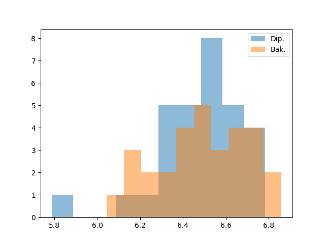
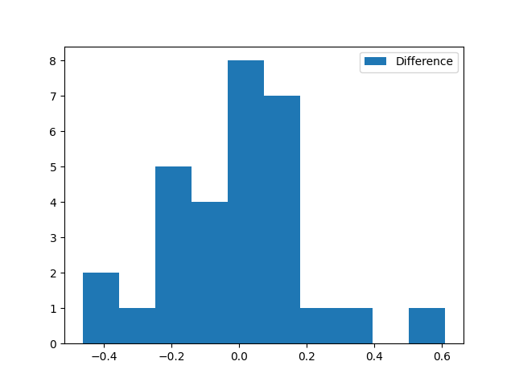
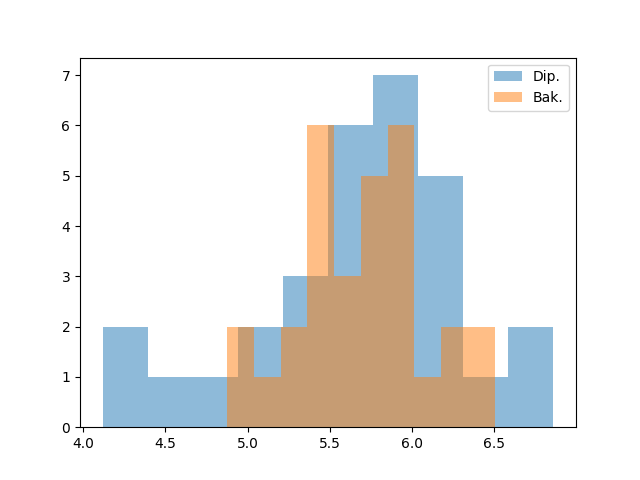
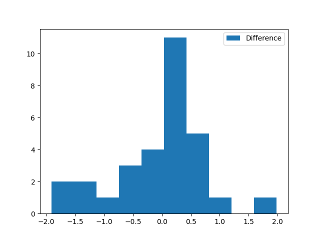

# PriDav

Tím: `bez názvu` \
Autori: ``Martin Kostolník, Filip Prutkay, Jakub Skaloš, Martin Striženec`` \
Zadanie: ``LLM začali byť populárne začiatkom roku 2023. Preto je teraz ideálna doba pozrieť sa na to,
ako ho používajú študenti pri písaní záverečných prác: veľa študentov, ktorí odovzdávali
svoju bakalársku prácu v roku 2022 (pred nástupom LLM) následne v roku 2024 (v čase už
hojného používania LLM) odovzdávali diplomovku na podobnú tému. Pomocou analýzy štýlu
písania (napríklad frekvencie k-tic písmen v nejakom úseku textu) skúste odhadnúť, za akú
časť diplomových prác študentov sú zodpovedné LLM``

**úvod**

**prečo slovenčina?**

## Hypotézy

1.  Ai-cka si casto vymyslavala linky takze vedeli by sme predpokladat ze prace po 2022 budu mat vacsi vyskyt neexistujucich linkov (aj ked problemom moze byt ze pri tych starsich aj ked vtedy existovali uz nemusia)
2. práce po 2022 budú mať výrazne väčšiu entropiu slov ako práce predtým, keďže AI má lepšiu slovnú zásobu. Samozrejme študentovi sa mohla zvýšiť slovná zásoba, preto nás zaujíma výrazný rozdiel
3. podobne by práce po 2022 mali mať vyššiu entropiu druhov viet podľa štruktúry, keďže čerpá zo štylistyky viac autorov. Tiež nás zaujíma iba štatisticky významný rozdiel 
4. rozdelenie dĺžok viet má v diplomových prácach nižšiu entropiu ako v bakalárskych (kvôli zásahu LLM)
5. diplomové práce častejšie obsahujú nepresné alebo neoveriteľné citácie než bakalárske práce rovnakých autorov
6. v diplomových prácach bude viac tzv. generických fráz, ktoré sú typické pre LLM (napr. frázy ako "je možné konštatovať" alebo "vo všeobecnosti platí")

## Dáta

Použitý dataset sa nachádza v priečinku `./prace`.
Obsahuje 30 párov záverečných prác - diplomová práca a bakalárska práca od jedného autora v slovenčine, čo je náš skúmaný jazyk.
Práce zároveň spĺňajú pravidlo, že bakalárske práce boli napísané v rokoch 2022 a pred, pričom diplomové práce po roku 2022
(vzhľadom na to že prvý generatívny AI model ChatGPT vznikol v novembri 2022).

Dáta boli zozbierané zo stránky `https://opac.crzp.sk`. 
Stránka je nevhodná na web-scraping. Síce každá práca má vlastný link na stránke, hľadanie prác prebieha cez JavaScript app, čiže vyhľadávanie sa nedá určiť v URL a následne výsledky zobrazuje len 20 až 100 výsledkov naraz. 
Tento fakt výrazne komplikoval zber dát, lebo tým pádom musel prebehnúť manuálne.

Výber prác chcel odrážať rozdelenie prác na stránke, z hľadiska odboru, školy a pohlavia autora.
Na to najprv poslúžili získané počty diplomových prác podľa odboru (* označuje odbory, kde nepíšu bakalársku prácu, tieto neboli zohľadnené vo výbere): 

|   KÓD | POPIS                                           |   POČET |
|------:|:------------------------------------------------|--------:|
|  1113 | Matematika                                      |       5 |
|  1217 | Vedy o Zemi                                     |       7 |
|  1420 | Chémia                                          |       4 |
|  1536 | Biológia                                        |      20 |
|  1610 | Ekologické a environmentálne vedy               |       4 |
|  2118 | Získavanie a spracovanie zemských zdrojov       |       8 |
|  2381 | Strojárstvo                                     |      52 |
|  2508 | Informatika                                     |      30 |
|  2647 | Kybernetika                                     |      13 |
|  2675 | Elektrotechnika                                 |      13 |
|  2820 | Chemické inžinierstvo a technológie             |       7 |
|  2908 | Biotechnológie                                  |       4 |
|  2940 | Potravinárstvo                                  |       8 |
|  3331 | Drevárstvo                                      |       3 |
|  3507 | Architektúra a urbanizmus                       |       6 |
|  3636 | Geodézia a kartografia                          |       5 |
|  3659 | Stavebníctvo                                    |      15 |
|  3772 | Doprava                                         |       7 |
|  4190 | Poľnohospodárstvo a krajinárstvo                |       5 |
|  4219 | Lesníctvo                                       |       2 |
|  5141 | Všeobecné lekárstvo*                            |     614 |
|  5166 | Zubné lekárstvo*                                |      94 |
|  5214 | Farmácia*                                       |       5 |
|  5602 | Ošetrovateľstvo                                 |     506 |
|  5607 | Verejné zdravotníctvo                           |     168 |
|  5618 | Zdravotnícke vedy                               |      65 |
|  6107 | Filozofia                                       |      12 |
|  6115 | Sociológia a sociálna antropológia              |       6 |
|  6171 | Teológia                                        |       9 |
|  6213 | Ekonómia a manažment                            |     775 |
|  6718 | Politické vedy                                  |      87 |
|  6835 | Právo                                           |     158 |
|  7115 | Historické vedy                                 |      27 |
|  7205 | Mediálne a komunikačné štúdiá                   |      55 |
|  7320 | Filológia                                       |      48 |
|  7418 | Veda o športe                                   |      32 |
|  7605 | Učiteľstvo a pedagogické vedy                   |     385 |
|  7701 | Psychológia                                     |      79 |
|  7761 | Sociálna práca                                  |     920 |
|  8110 | Veda o umení a kultúre                          |      27 |
|  8202 | Umenie                                          |      61 |
|  9205 | Bezpečnostné vedy                               |     390 |
|  9610 | Obrana a vojenstvo                              |      14 |

Následne prebiehal výber. Príbuzné odbory, kde bolo k dispozícii málo prác, boli spojené do jednej query a z nej bol vytiahnutý pseudo-náhodný (s ohľadom na školu a pohlavie). V tabuľke nižšie je prehľad všetkých prác, pričom medzi odbormi sú všetky z query, výsledne vybraný je označený boldom:

| ODBORY                                                                                                                                                                    | MENO         | PRIEZVISKO      | NAZOV_BAK                                                                                                   | NAZOV_DIP                                                                                                                               |
|:--------------------------------------------------------------------------------------------------------------------------------------------------------------------------|:-------------|:----------------|:------------------------------------------------------------------------------------------------------------|:----------------------------------------------------------------------------------------------------------------------------------------|
| Matematika, **Informatika**, Kybernetika,Elektrotechnika                                                                                                                        | Tomáš        | Vago            | Webová aplikácia na správu strešných stavieb                                                                | GPS systém pre kynologické záchranné zložky                                                                                             |
| Vedy o Zemi, Chémia, Biológia, **Ekologické a environmentálne vedy**, Získavanie a spracovanie zemských zdrojov, Chemické inžinierstvo a technológie, Biotechnológie, Potravinárstvo | Juraj        | Obuch           | Hodnotenie retencie vody a mikrobiálnej diverzity v zhutnených lesných a poľnohospodárskych pôdach          | Využitie retenčných vlastností superabsorpčných polymérov ako adaptačného opatrenia pre ochranu pôdy voči klimatickej zmene             |
| Strojárstvo                                                                                                                                                               | Miroslav     | Mareček         | Vplyv hluku na kvalitu pracovného prostredia vo vybranom podniku                                            | Návrh technologicko-technického riešenia objektu na farme dojníc v Oponiciach                                                           |
| Drevárstvo, Architektúra a urbanizmus, Geodézia a kartografia, Stavebníctvo, Doprava, Poľnohospodárstvo a krajinárstvo, **Lesníctvo**                                               | Jana         | Kľačková        | Zhodnotenie a návrh úprav poľovníckych chát na území LS Kyslinky, OZ Kriváň                                 | Analýza vývoja trofejovej kvality jelenej zveri v CHPO Poľana od roku 1995 po súčasnosť vplyvom dodržiavania kritérií selektívneho lovu |
| Filozofia, Sociológia a socialna antropológia, Teológia, **Filológia**, Historické vedy                                                                                           | Jozef        | Žigo            | Komentovaný preklad eseje od Rolanda Barthesa                                                               | ANALÝZA PREKLADU VLASTNÝCH MIEN A NÁZVOV V DIELE TEMNÝ OHEŇ                                                                             |
| Zdravotnícke vedy                                                                                                                                                         | Anna         | Hubčíková       | VPLYV MUTÁCIE FAKTORA V LEIDEN NA TEHOTENSTVO A JEHO DIAGNOSTIKA                                            | MONITOROVANIE ANTITROMBOTICKEJ LIEČBY NÍZKOMOLEKULOVÝMI HEPARÍNMI U HOSPITALIZOVANÝCH PACIENTOV POČAS PANDÉMIE COVID-19                 |
| Verejné zdravotníctvo                                                                                                                                                     | Patrik       | Posvancz        | DIAGNOSTICKÉ A TERAPEUTICKÉ METÓDY PRI OCHORENIACH ÚSTNEJ DUTINY A PAŽERÁKA                                 | Optimalizácia radiačnej ochrany na pracovisku so zdrojmi ionizujúceho žiarenia                                                          |
| Verejné zdravotníctvo                                                                                                                                                     | Vivien       | Stefankoviczová | Komunitná pneumónia ako problém verejného zdravotníctva                                                     | Infekčné ochorenia dýchacích ciest u detí                                                                                               |
| Politické vedy                                                                                                                                                            | Klaudia      | Kurillová       | Aktuálne podoby medzinárodného terorizmu                                                                    | Postoje krajín V4 voči Európskej migračnej kríze                                                                                        |
| Mediálne a komunikačné štúdiá                                                                                                                                             | Samuel       | Reščák          | Súčasné trendy v marketingovej komunikácii medzi firmou a spotrebiteľom                                     | Optimalizácia nákupného procesu vybraného e-shopu                                                                                       |
| **Umenie**, Veda o umení a kultúre                                                                                                                                             | Anežka       | Hudáčková       | Využitie cimbalu v jazzovej a populárnej hudbe                                                              | Interpretácia ázijskej hudobnej literatúry so zameraním na santour, yangqin, qanun                                                      |
| Psychológia                                                                                                                                                               | Martina      | Glosová         | Sebahodnotenie a sociálno-emocionálne zdravie žiakov Montessori školy a tradičnej základnej školy           | Sociálne reprezentácie polyamorie u psychoterapeutov a psychoterapeutiek na Slovensku                                                   |
| Právo                                                                                                                                                                     | Réka         | Kosárová        | Ochrana informácií v obchodno-právnych vzťahoch                                                             | Medzinárodnoprávna ochrana životného prostredia počas ozbrojeného konfliktu                                                             |
| Právo                                                                                                                                                                     | Volodymyr    | Prokofiiev      | Reforma Spoločného Európskeho Azylového Systému                                                             | Hodnotenie dôkazov v civilnom procese                                                                                                   |
| Veda o športe                                                                                                                                                             | Martin       | Činčár          | Využitie pohybových hier v pohybovej príprave detí                                                          | Vzťah pohybovej aktivity a kognitívnych schopnosti adolescentov                                                                         |
| Bezpečnostné vedy                                                                                                                                                         | Miklós       | Hervay          | Možnosti využitia vedľajších produktov z poľnohospodárskej výroby                                           | Zásady bezpečnosti práce pri opravách a údržbe strojov vo vybranom poľnohospodárskom podniku                                            |
| Bezpečnostné vedy                                                                                                                                                         | Miloš        | Mražík          | Kyberšikana adolescentov a možnosti jej riešenia                                                            | Branná príprava obyvateľov ako základný prvok obrany štátu                                                                              |
| Učiteľstvo a pedagogické vedy                                                                                                                                             | Nikola       | Špaková         | Možnosti využitia kruhových cvičení v školskom klube detí                                                   | Poruchy pozornosti u učiteliek a učiteľov pre primárne vzdelávanie                                                                      |
| Učiteľstvo a pedagogické vedy                                                                                                                                             | Dominika     | Kiššová         | Využitie audiovizuálnej didaktickej techniky v hudobnom vzdelávaní                                          | Vplyv pamäte a pozornosti na čítanie s porozumením u detí v prvom ročníku ZŠ                                                            |
| Učiteľstvo a pedagogické vedy                                                                                                                                             | Tomáš        | Hilkovič        | Prvá cesta okolo sveta a staré mapy s ňou súvisiace                                                         | Individuálna koncepcia vyučovania učiteľov dejepisu                                                                                     |
| Ošetrovateľstvo                                                                                                                                                            | František    | Pelikán         | Komplexná ošetrovateľská starostlivosť o pacienta s náhlou cievnou mozgovou príhodou                        | Informovanosť laickej verejnosti o postupoch prvej pomoci pri akútnom infarkte myokardu                                                 |
| Ošetrovateľstvo                                                                                                                                                           | Dominika     | Chladná         | Ošetrovateľský proces u pacienta s posttraumatickou stresovou poruchou                                      | Posttraumatická stresová porucha u zdravotníckych pracovníkov v zariadeniach pre seniorov v pandémii COVID-19                           |
| Ošetrovateľstvo                                                                                                                                                           | Lucia        | Šišmičová       | Komplexná ošetrovateľská starostlivosť o pacienta s Polyetiologickou demenciou                              | KVALITA ŽIVOTA U KLIENTOV V ZARIADENÍ SOCIÁLNYCH SLUŽIEB S AMYOTROFICKOU LATERÁLNOU SKLERÓZOU                                           |
| Ošetrovateľstvo                                                                                                                                                           | Lea          | Baloghová       | Kvalitatívna porucha vedomia pacientov na jednotkách intenzívnej starostlivosti                             | Assessment bazálnej stimulácie pri ošetrovateľskej starostlivosti o pacientov v kóme                                                    |
| Ekonómia a manažment                                                                                                                                                      | Simona       | Moravská        | VYUŽITIE PSYCHOLÓGIE V MARKETINGU A V REKLAMÁCH                                                             | PSYCHOLOGICKÉ FAKTORY VPLÝVAJÚCE NA SPOTREBITEĽSKÉ SPRÁVANIE                                                                             |
| Ekonómia a manažment                                                                                                                                                      | Miroslava    | Podracká        | Distribučné systémy v ubytovacích zariadeniach                                                              | Kognitívna mapa a jej adaptácia v rozhodovaní manažérov                                                                                 |
| Ekonómia a manažment                                                                                                                                                      | Radka        | Petríková       | Náklady a výnosy a ich vplyv na hospodársky výsledok podniku                                                | Minimálna mzda v krajinách V4 a jej vplyv na zamestnanosť                                                                               |
| Ekonómia a manažment                                                                                                                                                      | Patrik Tomáš | Galanda         | Aktuálne problémy MSP pri získavaní finančných zdrojov                                                      | Podpora univerzít zo zdrojov politiky súdržnosti                                                                                        |
| Ekonómia a manažment                                                                                                                                                      | Andrej       | Adamov          | Podnikateľské prostredie v krajinách Európskej únie                                                         | Lokalizácia ako dôležitý predpoklad znižovania budúcich nákladov podniku                                                                |
| Ekonómia a manažment                                                                                                                                                      | Alena        | Mižíková        | Analýza využívania metodík projektového riadenia v závislosti od typu projektu a prostredia jeho realizácie | Digitálna transformácia práce - výzvy a riziká                                                                                          |

Stiahnuté súbory vo formáte `.pdf` boli prevedené na formát `.txt`, aby sa dalo s nimi lepšie pracovať. 
Na to nám pomohol program `pdftotext` z knižnice `Poppler`.

## Metodológia a výsledky

### Hypotéza 1: predikovateľnosť obdobia vzniku práce podľa validity internetových zdrojov

Táto hypotéza sa zameriava na predpoklad, že používanie generatívnych jazykových modelov (LLM) pri písaní záverečných prác sa môže prejaviť zvýšeným výskytom neexistujúcich alebo nefunkčných internetových zdrojov. Tento jav je známy najmä z počiatočných verzií LLM, ktoré mali tendenciu generovať vierohodne vyzerajúce, avšak fiktívne referencie.

Premisou tejto hypotézy je tvrdenie, že práce vytvorené v období rozšíreného používania generatívnej AI (rok 2023 a neskôr) sa dajú odlíšiť od starších prác na základe štatistických charakteristík internetových odkazov, najmä:
- počtu všetkých URL,
- počtu nefunkčných URL,
- podielu nefunkčných URL,
- zastúpenia jednotlivých typov chýb (napr. HTTP 404, timeout, SSL).

Formálne testujeme hypotézu, či na základe týchto znakov vieme predikovať, či práca vznikla:
- **pred rokom 2023**,  
- alebo **v roku 2023 a neskôr**.
---
### Postup overenia hypotézy
Samozrejme začneme s tým že si to vykreslíme do grafou a či sa z toho nedá niečo spraviť metódou pozriem a až potom nakódim. Týmto som došiel k nasledujúcim obrázkom ktoré možno ešte prerobím tak aby tam aj boli legendy (update: spravne poposuvane).

Následne sme si dáta rozdelil na 5 skupín:
- train.csv (60% dát)
- val.csv (10% dát)
- test.csv (10% dát)
- test2.csv (10% dát)
- test3.csv (10% dát)

Keďže získavanie nových dát je vcelku bolestivé (ako bolo popísané vyššie) tak sme si vytvorili 3 testovacie datasety aby sme mohli niečo pokaziť a stále dobre bolo

Každá práca bola reprezentovaná jedným riadkom agregovaných dát, pričom výsledný dataset obsahoval 38 prác. Cieľová premenná bola binárna:
- 0 – práca vznikla pred rokom 2023,  
- 1 – práca vznikla v roku 2023 alebo neskôr.

Vzhľadom na obmedzený počet dát bolo zvolené hodnotenie pomocou **Leave-One-Out Cross-Validation (LOOCV)**, kde sa postupne trénuje na \(n-1\) vzorkách *(tu sme si spojili trenovaci a validacny dataset)* a jedna vzorka slúži ako validačná.

Testované boli nasledujúce modely:
1. Logistická regresia (lineárna),
2. Logistická regresia s polynomiálnymi znakmi 2. stupňa,
3. Logistická regresia s polynomiálnymi znakmi 3. stupňa,
4. Naivný Bayesovský klasifikátor (Gaussian Naive Bayes).

Ako hlavná hodnotiaca metrika bola použitá **balanced accuracy**, ktorá je vhodná pri nevyvážených triedach, keďže zohľadňuje úspešnosť klasifikácie oboch tried samostatne.
---
### Výsledky Leave-One-Out Cross-Validation

Výsledky LOOCV boli nasledovné:

- **Logistická regresia s polynomiálnymi znakmi 3. stupňa**  
  - accuracy: 0.763  
  - balanced accuracy: **0.767**  
  - precision (≥ 2023): 0.824  
  - recall (≥ 2023): 0.700  

- Logistická regresia s polynomiálnymi znakmi 2. stupňa  
  - balanced accuracy: 0.711  

- Naivný Bayesovský klasifikátor  
  - balanced accuracy: 0.717  

- Logistická regresia (lineárna)  
  - balanced accuracy: 0.658  

Najlepší výsledok dosiahla logistická regresia s polynomiálnymi znakmi 3. stupňa, ktorá bola preto zvolená ako finálny model.
---
### Overenie na testovacej množine

Zvolený model bol následne natrénovaný na spojení **tréningovej a validačnej množiny** a vyhodnotený na samostatnej testovacej množine.

Testovacie množiny obsahovali iba 6 prác *(až neskôr som si všimol)*, čo výrazne obmedzuje výpovednú hodnotu výsledkov. Napriek tomu boli dosiahnuté nasledovné metriky pre logistickú regresiu 3. stupňa:

- accuracy: 0.667
- balanced accuracy: **0.625**  
- precision (≥ 2023): 0.750 
- recall (≥ 2023): 0.750  
- confusion matrix: \(\begin{bmatrix}1 & 1\\1 & 3\end{bmatrix}\)

Ako porovnávací baseline bol otestovaný aj naivný Bayesovský model (GaussianNB) trénovaný rovnako na train+val:

- accuracy: 0.667  
- balanced accuracy: **0.800**  
- precision (≥ 2023): 0.333  
- recall (≥ 2023): 1.000  
- confusion matrix: \(\begin{bmatrix}3 & 2\\0 & 1\end{bmatrix}\)

Z uvedených výsledkov je zrejmé, že pri veľmi malej testovacej množine môžu byť metriky výrazne nestabilné a citlivo závislé od jednotlivých príkladov.
---
### Diskusia výsledkov

Výsledky naznačujú, že charakteristiky nefunkčných internetových odkazov nesú určitú informáciu o období vzniku práce, keďže model dosiahol výrazne lepšie výsledky než náhodná klasifikácia, najmä v rámci LOOCV.

Zároveň je však potrebné zdôrazniť:
- malý počet vzoriek,
- veľmi malú testovaciu množinu,
- a potenciálnu heterogenitu správania autorov pri používaní AI nástrojov.

Výsledky preto nemožno interpretovať ako dôkaz systematického používania AI, ale skôr ako náznak existencie slabého signálu, ktorý by pri väčšom datasete mohol viesť k štatisticky robustnejším záverom.
---
### Záver hypotézy

Na základe vykonaných experimentov možno konštatovať, že:
- hypotézu o možnosti rozlíšenia obdobia vzniku práce na základe validity internetových zdrojov **nie je možné jednoznačne potvrdiť ani vyvrátiť**,  
- avšak získané výsledky naznačujú, že daný prístup **má potenciál** a zasluhuje si ďalší výskum na väčšej dátovej množine.

### Hypotéza 2: entropia slovnej zásoby

Táto hypotéza sa zameriava na globálnu tendenciu používať viac generatívne AI na písanie prác. 
Premisou tejto hypotézy je fakt, že AI bolo natrénované na veľkom množstve autorov, preto bude niesť zjednotenie množstva slovných zásob.
Tým pádom slovná zásoba akéhokoľvek jednotlivca by mala byť podmnožinou tej AI.
To by sa malo preukázať v zvýšenej entropii v diplomovvých prácach oproti tým bakalárskym.

Na overenie tejto hypotézy potrebujeme uskutočniť:
1. Všetky slová z každej práce transformovať do gramaticky neutrálnej podoby
2. Pre každú prácu vypočítať entropiu z počtov rovnakých slov vrámci práce
3. Štatisticky overiť signifikantnosť výsledkov

Prvý krok vykonáva program `lemmatization.py`, ktorý načíta knižnicu `stanza` v slovenskom jazyku a vypíše výsledný text.
Knižnica používa na túto úlohu neurónovú sieť, ktorá avšak neuvádza 100% presné výsledky.
To nám však neprekáža, pretože chyby robí pomerne konzistentne, inak vysloňované slovo s rovnakým základom stále uvedie do rovnakého tvaru.

Druhý krok vykonáva program `word_entropy.py`, ktorý si slová ukladá do `dictionary` a z nich vypočíta pravdepodobnosti pre funkciu `scipy.stats.entropy`.
Výsledné entropie vypíše vo formáte `.csv`.

Tretí krok vykonáva `statistics.py`, ten najprv overí normalitu dát pomocou Shapiro-Wilk testu.
Ak dáta výjdu normálne v oboch distribúciach pre bakalárske aj diplomové práce, použije párový T-test.
Ak aspoň jedna nevýjde, použije radšej neparametrický párový Wilcoxonov test.
Tiež vykreslí histogramy pre porovnanie distribúcií.

Dáta pre diplomové práce nevyšli normálne, čiže bol použitý Wilcoxonov test. Ten ukázal $p-value \approx 0.9$, 
čiže hypotézu $H_0 : \theta_{bak} = \theta_{dip}$ zamietnuť nemôžme.
To potvrdzuje aj očný test na grafoch:

Tu je vrchol distribúcie veľmi tesne pri sebe, pričom skôr vyšší pri diplomových prácach. 

Rozdiel distribúcií $dip - bak$, vidíme, že stred distribúcie leží na nule a jemne doprava. 

### Hypotéza 3: entropia druhov viet

Táto hypotéza vychádza z rovnakej premisy ako hypotéza 3, že by štylistika písania AI mala byť rozmanitejšia ako pri človekom napísanom texte.
Preto skúmame, či by sa to malo preukázať v zvýšenej entropii druhov viet v diplomovvých prácach oproti bakalárskym.
Druh vety identifikujeme stavbou vety podľa vetných členov.
To nám vie umožniť opäť knižnica `stanza`.

Na overenie tejto hypotézy potrebujeme uskutočniť:
1. Všetky slová z každej vety každej práce transformovať na príslušný charakterizátor vetného člena
2. Pre každú prácu vypočítať entropiu z počtov rovnako stavaných viet
3. Štatisticky overiť signifikantnosť výsledkov

Prvé dva kroky robí program `sent_entropy.py`, ktorý priamo vezme celý text, prevedie slová. 
Takto zložené vety v stringoch používa ako kľúč v `dictionary`, ktorý ráta počet výskytov.
Entropiu následne počíta identicky ako hypotéza 3.
Rovnako ako hypotéza 3 prebieha aj 3. krok, čiže overenie štatistickej signifikantnosti výsledkov.

Tentokrát vyšiel Shapiro-Wilk test normálny pre obe distribúcia, čiže sme použili párový T-test.
Tomu vyšla $p-value \approx 0.833$, čiže hypotézu $H_0 : \theta_{bak} = \theta_{dip}$ opäť zamietnuť nemôžme. 

Výsledky hypotézy 2 a 3 nenesú zistenie o používaní AI.
To môže byť zapríčinené výberom jazyka - slovenčiny, kde generatívne AI je známe tým, že píše pomerne nepresne oproti napríklad angličtine, preto môžu mať autori tendenciu skôr nepoužiť.
Tiež je možné, že autori už majú skúsenosti s písaním prác v dobe pred AI, čiže majú skúsenosti s písaním a tiež nemajú potrebu ho používať.
V oboch hypotézach boli entropie vyššie u diplomových prác, avšak málo signifikantne.
Možno by pomohol väčší dataset, ktorý by pomohol priradiť štatistickú signifikanciu aj pre namerané minimálne rozdiely.

Na otestovanie hypotéz 4., 5. a 6. sme použili Wilcoxonov test. Základný dôvod na to je, že dáta sú párové (bakalárske a diplomové práce) a pozorovania nie sú úplne nezávislé. Preto by nebolo správne použiť napr. t-test alebo z-test. Taktiež metriky, s ktorými sme pracovali, majú aj veľa extrémnych hodnôt, šikmé rozdelenie a výhodou Wilcoxonovho testu je, že nepredpokladá normalitu dát.

### Hypotéza 4: entropia dĺžok viet

Najprv sme sa zamerali na počty slov vo vetách. Domnievame sa, že počty slov vo vetách v textoch generovaných pomocou LLM majú menšiu entropiu, ako počty slov vo vetách v textoch napísaných len človekom. Jazykové modely majú totiž tendenciu písať podobne dlhé vety a veľmi nepoužívajú príliš krátke alebo príliš dlhé vety. To sa môže líšiť od ľudského spôsobu vyjadrovania. Pomocou Wilcoxonovho testu sme zistili, či je tento rozdiel entropií nejako štatisticky významný. V prípade, že by bola p hodnota menšia ako 0.05 by išlo o štatistickú významnosť. Výsledky však ukázali presný opak. P-hodnota vyšla približne 0.978 a ukázalo sa, že skôr pri bakalárskych prácach mali dĺžky viet väčšiu entropiu ako pri diplomových. Môže to byť spôsobené práve tým, že pri diplomových prácach sa vyžaduje presnejšie vyjadrovanie, prípadne študenti už mali väčšie skúsenosti s písaním práce. Kód testujúci túto hypotézu sa nachádza v súbore sentence_lengths.py.

### Hypotéza 5: presnosť citácií

Overovali sme taktiež presnosť citácií. Jazykové modely si často vymyslia zdroj, z ktorého by mala pochádzať údajná citácia. Kód v súbore citations_check.py zachytáva citácie typu (Novák, 2020) alebo (Novák et al., 2020). Následne je text celej práce rozdelený na hlavný text a zoznam literatúry. Kód počíta citácie bez zodpovedajúceho zdroja (missing_refs) a výskyt neplatných DOI (doi_errors). Následne vypočíta skóre pre každú prácu ((missing_refs + doi_errors) / len(citations)), a teda čím vyššie je toto skóre, tým horšia je kvalita citácií v texte práce. Očakávame teda, že bakalárske práce by mohli mať toto skóre vyššie. Wilcoxonov test tu zisťoval, či je rozdiel skóre medzi bakalárskymi a diplomovými prácami jedného študenta štatisticky významný. Opäť sa nepotvrdila štatistická významnosť, keďže p-hodnota dosiahla hodnotu okolo 0.353. Pravdepodobne bola chybovosť citácií kontrolovaná zhruba rovnako kvalitne pri oboch typoch prác, keďže zhruba v 79% prípadoch sa tieto skóre medzi typmi prác zhodovali.

### Hypotéza 6: generické frázy

LLM často používajú určité generické frázy na vyplnenie textu, ako napríklad "na základe uvedeného", "v neposlednom rade" a pod. Je teda zmysluplné predpokladať, že výskyt takýchto fráz bude väčší v diplomových prácach, ak boli napísané s asistenciou LLM a text nebol nejako zvlášť upravovaný pred odovzdaním. Človek má skôr tendenciu viac rozvíjať svoj jazyk počas písania a menej používa takéto generické frázy. Výskyt fráz sme počítali na 1000 slov, keďže na 1 slovo je táto hodnota príliš malá. Kód v súbore typical_phrases.py má k dispozícii určitú množinu týchto generických fráz. Následne zisťuje frekvencie ich výskytu v textoch prác. Wilcoxonov test tu zisťuje, či je štatisticky významný rozdiel výskytov týchto fráz medzi bakalárskymi a diplomovými prácami. S p-hodnotou 0.846 opäť nemôžeme hovoriť o štatistickej významnosti. Ukazuje sa naopak, že takéto frázy sa častejšie vyskytovali v bakalárskych prácach. Pravdepodobne preto, lebo študenti mali menšie vyjadrovacie schopnosti pri písaní bakalárok, alebo preto, že v diplomových prácach je menej priestoru na takéto frázy z dôvodu väčších nárokov na odbornosť textu.
